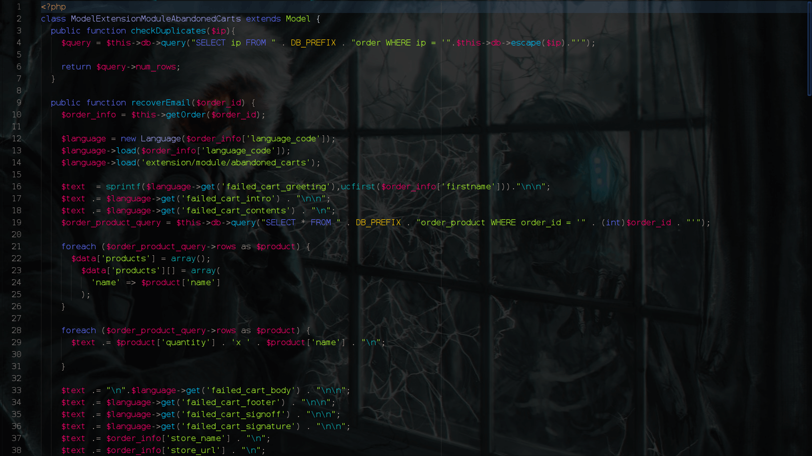

## Volcanic Dark Syntax theme
Dark syntax theme for Atom code editor with bright, neon colors.



> The UI theme used in the screenshot is [Ghoulish UI](https://github.com/angela-d/ghoulish-ui).

### Install

The easiest way to install is to do so from the Atom UI:

  - Go to Atom > Settings
  -  Click "+ Install"
  - Search for **volcanic dark syntax** and click themes button to search.
  - Browse for Volcanic Dark Syntax and click install

Alternatively, you can use the Atom Package Manager:
```bash
apm install volcanic-dark-syntax
```

### Credits
Based on [One Dark Syntax](https://github.com/atom/one-dark-syntax)
